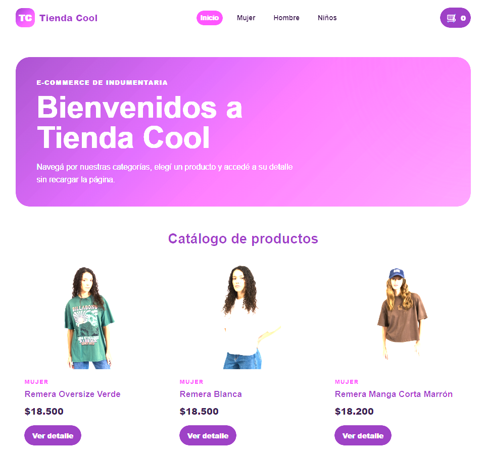

# Tienda Cool - Proyecto Final React JS

**Alumna:** Ivanna Arzamendia

Aplicación web de e-commerce desarrollada con React JS para el Proyecto Final del curso de React JS de Coderhouse.

La aplicación permite navegar por un catálogo de indumentaria, filtrar productos por categoría, consultar el detalle de cada producto, seleccionar cantidades, agregar productos al carrito y finalizar una compra generando una orden en Firebase Firestore.

## Funcionalidades

- Catálogo dinámico de productos.
- Filtrado por categorías: Mujer, Hombre y Niños.
- Navegación mediante React Router.
- Vista individual del detalle de cada producto.
- Contador de unidades con validación de stock.
- Carrito de compras administrado mediante Context.
- Visualización de cantidades, subtotales y total.
- Eliminación individual de productos.
- Opción para vaciar el carrito.
- Formulario de checkout con validaciones.
- Registro de órdenes de compra en Firebase Firestore.
- Visualización del ID de la orden generada.
- Mensajes de carga, carrito vacío y productos no encontrados.
- Diseño responsive.

## Tecnologías utilizadas

- React JS
- Vite
- React Router DOM
- Firebase
- Firestore
- JavaScript
- CSS

## Estructura principal

```text
src
├── components
├── context
├── data
├── services
├── App.jsx
├── main.jsx
└── styles.css
```

## Instalación

Clonar el repositorio:

```bash
git clone URL_DEL_REPOSITORIO
```

Ingresar a la carpeta:

```bash
cd NOMBRE_DEL_PROYECTO
```

Instalar dependencias:

```bash
npm install
```

Ejecutar la aplicación:

```bash
npm run dev
```

Después abrí en el navegador la URL que muestre la terminal, normalmente:

```txt
http://localhost:5173/
```

## Firebase

La aplicación utiliza Firebase Firestore como base de datos.

Colecciones utilizadas:

- products
- orders

## Variables de entorno

El archivo `.env` contiene las credenciales privadas de Firebase y no se incluye en el repositorio.

El archivo `.env.example` muestra la estructura necesaria para configurar el proyecto.

## Repositorio

[Proyecto Final - Tienda Cool React JS](https://github.com/IvannaAr94/TRABAJO-FINAL-Arzamendia-Tienda-Cool-REACT-JS)

## Vista previa


